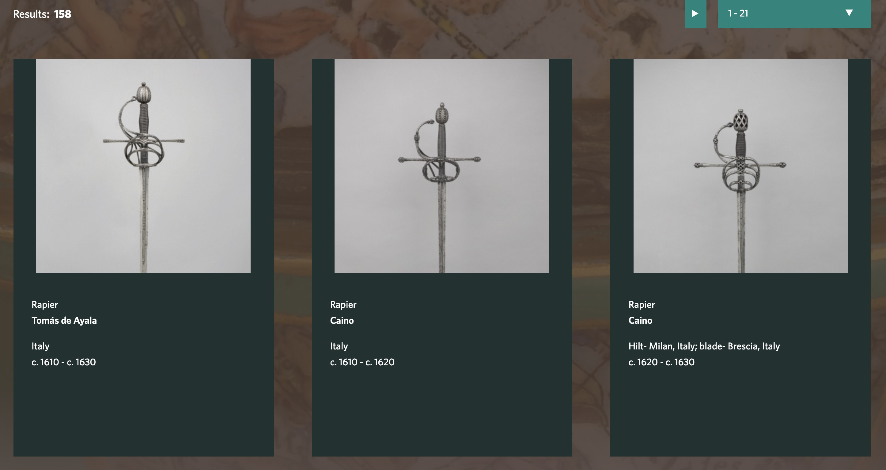
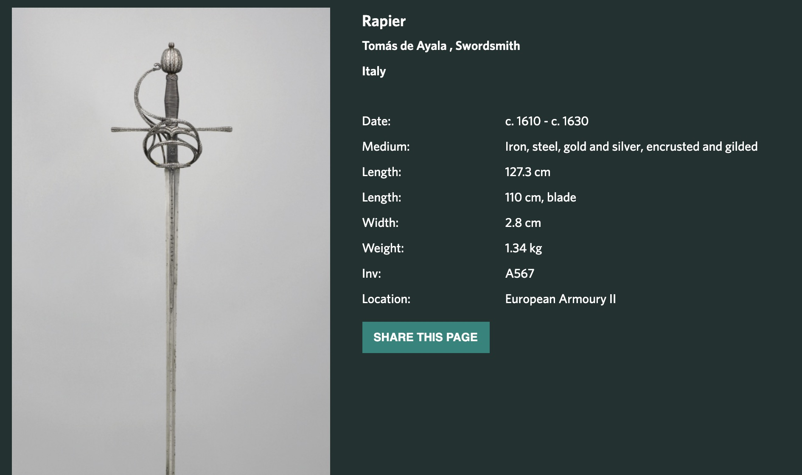

## Intro to HEMA

```{r setup, include=FALSE}
knitr::opts_chunk$set(echo = FALSE)
```

I have a passion, which is Historical European Martial Arts or HEMA. This is a sport and a martial art that focuses on fencing with earlier swords than the ones used in modern, classical fencing. I have been practising historical fencing for almost 10 years, starting in Madrid and then moving to Warsaw, where I was teaching rapier fencing.

As I mentioned, HEMA focuses mostly on fencing with swords, although other weapons are occasionally used. The two most common swords are the *longsword*, and the *rapier*. The longsword, depicted below, was a sword used from the late 14th till the early 16th century.

```{r, fig.cap="A reproduction of a longsword for HEMA training from https://www.fabri-armorum.com/en/p/longsword/", out.extra="class=external"}
knitr::include_graphics("https://www.fabri-armorum.com/wp-content/uploads/2016/11/longsword-bastard.jpg")
```

The rapier is a later sword, which started to appear in the 16th century and was still in use in the early 18th century. There's an ongoing debate as to whether the earlier "sideswords" can be considered early rapiers or they should be considered different weapons. More on this later.

```{r, fig.cap="A HEMA rapier from https://www.fabri-armorum.com/en/p/rapier-hema/", out.extra="class=external"}
knitr::include_graphics("https://www.fabri-armorum.com/wp-content/uploads/hema-rapier1.jpg")
```

<aside>

A *rapierist* is how a rapier fencer is usually called

</aside>

A key point of contention among rapierists is how these swords should be classified. One can attend to the weight, the length, the width, and especially the morphology of the swords in order to classify them. In fact, the famous [Oakeshott typology](https://en.wikipedia.org/wiki/Oakeshott_typology) does exactly that, classifying early medieval swords and longswords according to the morphology of archaeological remains of swords collected from the 10th to the 17th century.

```{r, fig.cap="Oakeshott typology", out.extra="class=external", layout="l-body-outset"}
knitr::include_graphics("https://upload.wikimedia.org/wikipedia/commons/e/e4/Oakeshott_types.png")
```

For rapiers, however, there's not a single, widely accepted typology of how to classify the different types of rapiers. We have Spanish rapiers, and Italian rapiers, French, German and even English rapiers but the morphology is all over the place. This is not at all surprising as the master swordsmiths travelled to offer their services to nobles and general rich patrons to forge their swords.

## Data science to the rescue

But when you think about it, *classifying* images is something data science has become pretty good at, hasn't it? We have classifiers for distinguishing cats from dogs, dogs from muffins, and on a less frivolous note, whales from one another, rusty pipes, crime suspects, and so on and so forth. Could we build a similar classification using sword images?

```{r}
#TODO Add links with examples above

```

### The Wallace collection

The Wallace collection is a (free!) museum in London that contains lots of paintings, sculpture, and, relevant to our purposes, arms and armour. From the description in their site:

> The Wallace Collection is an internationally outstanding collection which contains unsurpassed masterpieces of paintings, sculpture, furniture, arms and armour and porcelain.  
> Built over the eighteenth and nineteenth centuries by the Marquesses of Hertford and Sir Richard Wallace, it is one of the finest and most celebrated collections in the world.  
> So that it could be kept together and enjoyed by generations of visitors, the collection was given to the British Nation in 1897. It was an astonishing bequest and one of the greatest gifts of art works ever to be transferred into public ownership.   
> Today, our job is to maintain, research, and inspire the public to love and understand the Collection.

<aside>
[The Wallace Collection site](https://www.wallacecollection.org/)
</aside>

In particular, we're interested in the collection of _rapiers_ they have. The site includes a [collection link](https://wallacelive.wallacecollection.org/eMP/eMuseumPlus) that can be used for search for items. We search for the term 'rapier' and see what we get: 

{.external}
An individual entry looks like this: 



That seems ok, we have an image and a number of measures. However, there doesn't seem to be a database for this kind of information. Rather, it seems that the values are hardcoded 

Each entry of the Wallace collection looks like... There is no database apparently, the info is hardcoded directly in the page...

Web scraping is hard because it is a modal, the order of fields is not consistent...

So it has to be done manually...

So far I have obtained the following data, which I have pinned... (maybe I'll put it in a package...)

But there is another problem, and that is that the naming of the "length" term is not consistent - in some cases there's a blade length and a length value for overall length, but often there's only length...

If it's only length then my first assumption was that it referred to overall length, but there's a problem... the value of 'length' when blade == NA tends to be much shorter than the length when we have both overall length and blade length. So one would be inclined to thing that length without mentioning blade length means actually blade length and not overall length, which is confusing...

moreover we have cases in which the length value is 132 cm, and there's no blade length value, so it would be a blade length - but the problem is that a rapier with a blade of 132 cm would have an overall length of \~150 cm *and that is insanely long*... so we have hypothesis 1 it is actually a super long blade or hypothesis 2 the data is screwed up and the value of 132 refers to overall length, breaking the rule we induced in the previous paragraph. A sword of total length of 132 is still pretty long, but not incredibly so.

A sophisticated way to go around it is that we have empirical distributions of two quantities, overall length and blade length. They overlap somewhat, as some rapiers have long blades, longer than the overall length of a shorter rapier.

So if we can estimate the distribution of values of length for overall length and blade length, we can estimate how much more probable is a given value to be from the blade or from the overall lengths distribution.
